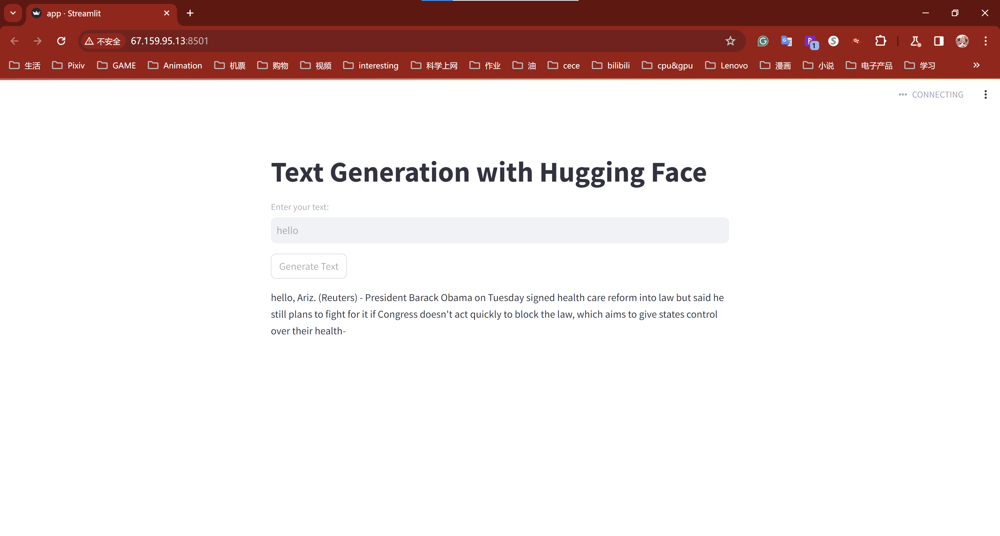

# yx248-mini9

Briefly describe your project, including its purpose and any unique features or capabilities. Mention the integration with Hugging Face models and the use of Streamlit for the web interface.

[My Hugging Face Streamlit App link](http://18.216.155.208:8501/)

## Getting Started

### Install Streamlit Using Command Line
creating an environment with venv and installing Streamlit with pip.

Prerequisites:

1. Python
Streamlit support version 3.8 to 3.12.

2. A Python package manager
Package managers handle installing each of your Python packages, including Streamlit.
I am using pip, which comes with Python.

### Create an Environment Using Venv

1. Open a terminal and navigate to your project folder.

```bash
cd myproject
```

2. Generate the ".venv" folder, which is where your virtual environment and its dependencies are installed.

```bash
python3 -m venv .venv
```

### Install Streamlit in Environment

1. In the terminal with your environment activated, type:

```bash
pip3 install streamlit
```

2. Test that the installation worked by launching the Streamlit Hello example app:

```bash
streamlit hello
```

If this doesn't work, use the long-form command:

```bash
python3 -m streamlit hello
```

### Create an App and Run

1. Create a file named `app.py` in project folder.
2. Any time you want to use your new environment, you first need to go to your project folder (where the .venv directory lives) and run the command to activate it:

```bash# Linux
source .venv/bin/activate
```

3. Once activated, you will see your environment's name in parentheses at the beginning of your terminal prompt. "(.venv)"
4. Run Streamlit app.

```bash
streamlit run app.py
```

If this doesn't work, use the long-form command:

```bash
python3 -m streamlit run app.py
```

5. To stop the Streamlit server, press `Ctrl+C` in the terminal.


## Connect to an open source LLM (Hugging Face)

### Installation
To get started, install the huggingface_hub library:

```bash
pip3 install --upgrade huggingface_hub
```

### Authentication
In a lot of cases, you must be authenticated with a Hugging Face account to interact with the Hub: download private repos, upload files, create PRs,… Create an account if you don’t already have one, and then sign in to get your User Access Token from your Settings page. The User Access Token is used to authenticate your identity to the Hub.

### Login command

The easiest way to authenticate is to save the token on your machine. You can do that from the terminal using the login() command:

```bash
huggingface-cli login
```

The command will tell you if you are already logged in and prompt you for your token. The token is then validated and saved in your HF_HOME directory (defaults to ~/.cache/huggingface/token). Any script or library interacting with the Hub will use this token when sending requests.

Alternatively, you can programmatically login using login() in a notebook or a script:

```python
from huggingface_hub import login
login()
```

### Usage

#### Hugging Face transformers Library
- Purpose: The transformers library is designed to provide an easy-to-use interface for working with various state-of-the-art machine learning models for natural language processing (NLP) tasks. It abstracts away much of the complexity involved in loading, configuring, and utilizing these models.

#### Pipeline
- Function: The pipeline function from the transformers library creates a pipeline for a specific NLP task. In your case, 'text-generation' specifies that the pipeline is set up for generating text.

- Model Specification: By specifying model='gpt2', you're telling the pipeline to use the GPT-2 model. GPT-2 is a large transformer-based model known for its ability to generate coherent and contextually relevant text based on a given prompt.

- Simplicity: The beauty of using pipeline is that it takes care of downloading the model and its associated tokenizer (responsible for converting input text into a format the model can understand) and setting them up for the task you've specified. This simplification allows developers to use sophisticated models without needing deep understanding of their inner workings.


## Deploying on AWS

After complete the funcion, deploy it on the AWS. Ensure your AWS instance has more than 1GB of RAM to accommodate the memory requirements of installing `torch` and `tensorflow`.

- [Deploy guide](https://www.youtube.com/watch?v=DflWqmppOAg)
- [Deploy guide GitHub repository](https://github.com/entbappy/Deploy-Streamlit-app-on-EC2-instance)


## Example Output

Here is my App link: [AWS EC2 Instances App Link](http://18.216.155.208:8501/)

Here's what the app looks like, along with sample generated text:

